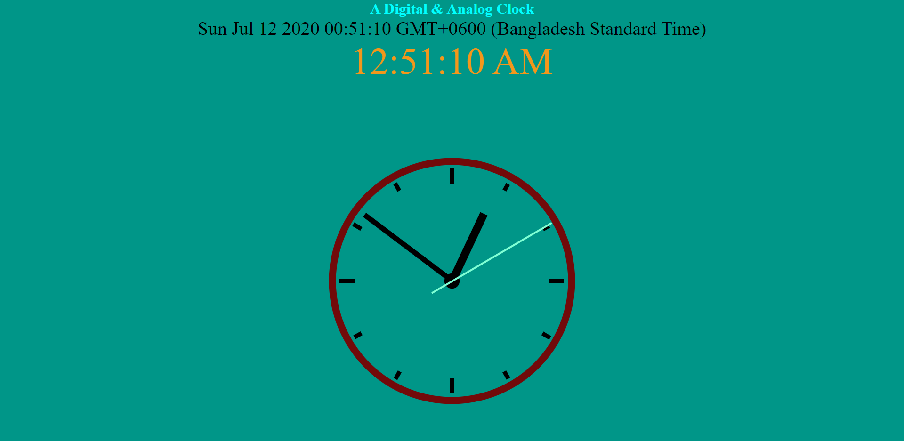

# Clock

Analog &amp; Digital Clock

## Using tools

- HTML
- CSS
- JavaScript
- SVG Image

## Features

1. Animated Analog Clock in Real-Time
2. Digital Clock GTC Local Time
3. Date, Month, Year
4. Location
5. Responsive
6. Ticking Clock sound in the Background

> SVG SAMPLE

```HTML
        <svg id="clock" xmlns="http://www.w3.org/2000/svg" width="600" height="600" viewBox="0 0 600 600">
            <g id="face">
                <circle class="circle" cx="300" cy="300" r="253.9"/>
                <path class="hour-marks" d="M300.5 94V61M506 300.5h32M300.5 506v33M94 300.5H60M411.3 107.8l7.9-13.8M493 190.2l13-7.4M492.1 411.4l16.5 9.5M411 492.3l8.9 15.3M189 492.3l-9.2 15.9M107.7 411L93 419.5M107.5 189.3l-17.1-9.9M188.1 108.2l-9-15.6"/>
                <circle class="mid-circle" cx="300" cy="300" r="16.2"/>
            </g>
            <g id="hour">
                <path class="hour-arm" d="M300.5 298V142"/>
                <circle class="sizing-box" cx="300" cy="300" r="253.9"/>
            </g>
            <g id="minute">
                <path class="minute-arm" d="M300.5 298V67"/>
                <circle class="sizing-box" cx="300" cy="300" r="253.9"/>
            </g>
            <g id="second">
                <path class="second-arm" d="M300.5 350V55"/>
                <circle class="sizing-box" cx="300" cy="300" r="253.9"/>
            </g>
        </svg>
```

> CSS SAMPLE

```CSS
.main {
  display: flex;
  padding: 2em;
  height: 90vh;
  justify-content: center;
  align-items: middle;
  display: flex;
  justify-content: center;
  align-items: center;
}

.clockbox,
#clock {
  width: 100%;
}
```

> JAVASCRIPT SAMPLE

```JavaScript

function showTime(){
    var date = new Date();
    var hr = date.getHours();
    var min = date.getMinutes();
    var sec = date.getSeconds();
    var session = "AM";

    if(hr == 0){
        hr = 12;
    }
    if(hr > 12){
        hr = hr - 12;
        session = "PM";
    }

    hr = (hr < 10) ? "0" + hr : hr;
    min = (min < 10) ? "0" + min : min;
    sec = (sec < 10) ? "0" + sec : sec;

    var time = hr + ":" + min + ":" + sec + " " + session;
    document.getElementById("digitalClock").innerText = time;
    document.getElementById("digitalClock").textContent = time;

    document.getElementById("date").innerText = date;
    document.getElementById("date").textContent = date;

    setTimeout(showTime,1000);


}

showTime();

```
> Sample Landing Page



### _View this Website in Live -_

https://njmsaikat.github.io/clock/

> Contact With Developer:


### Saikat Roy

> Email: njmsaikat@gmail.com

> Personal Portfolio: https://saikatroy.netlify.app/

> Linked In Profile: https://www.linkedin.com/in/njmsaikat/
